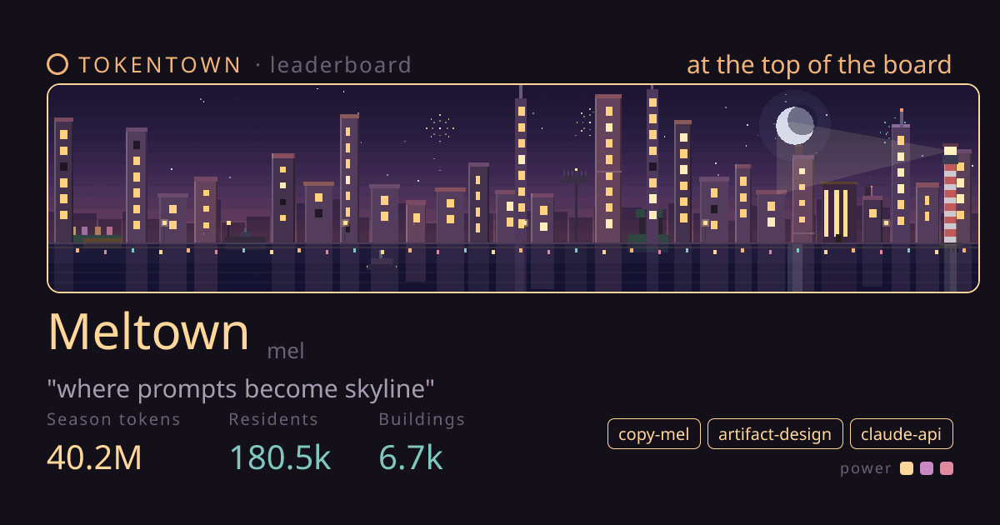
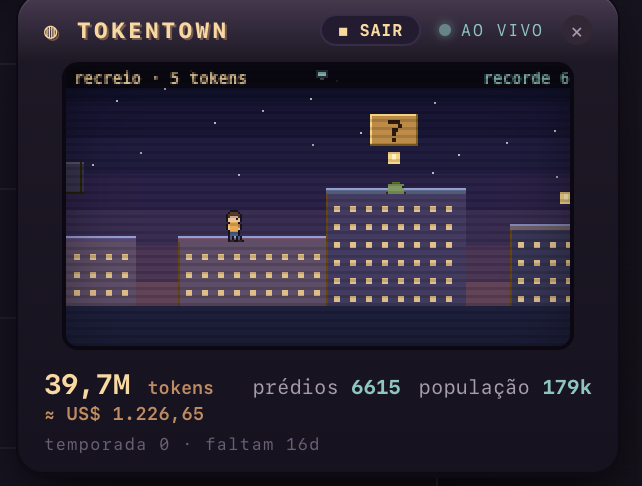

<p align="center">
  
</p>

<h1 align="center">TOKENTOWN</h1>
<p align="center"><em>where prompts become skyline</em></p>

<p align="center">
  A pixel city that grows in the corner of your screen while your AI agents work.<br>
  Every token they burn raises a building. Leave it open — it builds itself.
</p>

<p align="center">
  <b><a href="https://tokentown-gamma.vercel.app">🏙️ Live leaderboard</a></b> ·
  <b><a href="https://github.com/AElise08/tokentown">⬇️ Get the app</a></b>
</p>

---

## What it is

A tiny always-on-top overlay that reads your **real** Claude Code usage on your machine and turns it into a place:

- **Tokens → buildings.** Every token your agents burn becomes a building. Watch the skyline rise in real time — no tab to check.
- **28-day seasons.** Everyone's city resets on the same global clock, then you build again. Population, cost and buildings all carry the season.
- **Real-time day & night + weather.** The sky follows your local hour; windows light up at dusk, it rains, it snows in December. Cats on rooftops, a ferry, a rare blimp drifting past.

## Play while the agent works

<p align="center"></p>

While the agent is busy, hit **▶ recreio** for a little platformer across your own city's rooftops — a fresh map every run, with checkpoints and cache-block power-ups. The moment the agent finishes, or **needs a decision from you**, the game auto-pauses (a calm chime + a notification) so you get straight back to work.

## The leaderboard

[**tokentown-gamma.vercel.app**](https://tokentown-gamma.vercel.app) — every dev is a real pixel city, generated from their own numbers. Share yours at `/u/<name>`.

- Rank by **7 days** or the **28-day season**.
- **How this city was built** — an opt-in panel showing the *setup* behind the city: the skills, MCP servers, tools and models you actually use. Names and counts only — it's about learning each other's stacks, not just who spent most.

## Privacy

**Local-first.** The overlay reads your usage on your own machine. Only your **username and the numbers** are ever reported — **never** prompts, code, conversation content, or project names. Sharing your setup is **opt-in**.

## Get it

- **The overlay (macOS):** clone this repo and build it — a native app, **~384 KB** (Swift + the system WebView, no bundled browser).
  ```bash
  git clone https://github.com/AElise08/tokentown.git
  cd tokentown/game/swift
  ./build.sh && open TokenTown.app
  ```
- **Just watch:** browse everyone's cities at [tokentown-gamma.vercel.app](https://tokentown-gamma.vercel.app) — nothing to install.
- **No app? `npx tokentown`.** Report your city from the terminal in ~10 seconds — no install, [zero dependencies](cli/), Node 18+.
  ```bash
  npx tokentown            # first run picks a name + reports; prints your /u/<name> URL
  npx tokentown watch      # keep it running, reports every ~10 min
  npx tokentown --dry-run  # print exactly what would be sent — nothing leaves your machine
  ```
  Only your username and the numbers are sent — never prompts, code, or project names.

## This repo

A monorepo with three parts:

| Folder | What it is | Runs on |
|---|---|---|
| [`game/`](game/) | The desktop **overlay** — native macOS (Swift + WKWebView) that reads your usage and renders the city + the rooftop game. | your Mac |
| [`cli/`](cli/) | **`npx tokentown`** — a zero-dependency Node CLI that reads your usage and reports it, no app to install. | your terminal |
| [`site/`](site/) | The **leaderboard** — a Next.js app (Vercel + Upstash Redis) showing everyone's cities. | the web |

### Run the site locally
```bash
cd site && npm install && npm run dev   # http://localhost:3000
```

## How syncing works (FAQ)

**Does it count tokens I burned before installing / while it wasn't running?**
Yes. Claude Code itself writes a local transcript of every session (`~/.claude/projects`). TOKENTOWN doesn't listen in real time — it **reads that history**. On every launch (app) or run (CLI) it does a full **season backfill**: every token with a timestamp inside the current 28-day season is counted, deduplicated, whether or not TOKENTOWN was running at the time. Nothing is lost.

**Is it automatic?**
- **App:** yes — reads every ~1.5s (the city grows live) and reports to the board every ~3 min while open.
- **`npx tokentown`:** one full read + one report per run — run it again whenever you want to update.
- **`npx tokentown watch`:** keeps running and reports every ~10 min.

**Why is the board a few minutes behind my overlay?** Reports are throttled (~3 min) to be gentle on the server. The numbers converge the moment burning pauses.

**What doesn't it see?** Anything outside local Claude Code — e.g. claude.ai in the browser, or usage on another machine (run the CLI there too; same username, it merges).

## How it works

- Reads your Claude Code session transcripts under `~/.claude/projects/**/*.jsonl` (token usage, tool calls, models) with per-message **de-duplication** and a **per-season backfill** from timestamps — accurate whether the app was open or not, and it counts sub-agent usage too.
- The city that grows = `input + output + cache_creation` tokens; the honest **cost** estimate uses every field, including cache reads, with real per-model pricing.
- The overlay is a single hand-written canvas engine in a system WebView — no external assets, no bundled Chromium. Cities on the site are deterministic SVG.

---

<p align="center"><sub>Built by <a href="https://github.com/AElise08">@AElise08</a>. Not affiliated with Anthropic.</sub></p>
